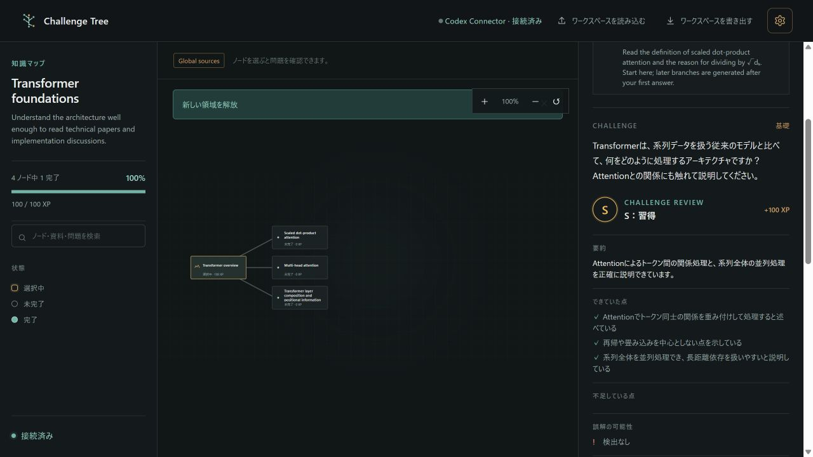

# Challenge Tree

Challenge Tree is a local-first adaptive learning app. It starts with one learning node, evaluates the learner's answer, and generates the next three nodes to continue the tree.

The web app is available as the [GitHub Pages version](https://kokuren333.github.io/ChallengeTree/). The page is served by GitHub Pages, while AI research, challenge generation, and grading are performed through the local connector running on the learner's own computer. In other words, the public page still uses a local-first data and Codex connection model.

[日本語 README](README.md)

## Features

- Explain mode (`explain`): one free-form response
- Short-answer mode (`short_answer`): three lightweight questions answered with a term, phrase, or short sentence
- True/false mode (`true_false`): five questions answered with only true or false
- A concise model answer and explanation for every generated challenge
- Saved answer history, grading results, live grading logs, and research history
- C / B / A / S grades and XP; a node is considered complete after it has been graded once
- Workspace-level JSON export and import
- A pannable, zoomable node map that expands three branches to the right after an answer
- Codex App Server model catalog and per-model reasoning-effort selection

## Live example

This screenshot uses the Japanese UI while answering the first Transformer challenge. After an S grade, the next three nodes were expanded. It shows progress on the left, the graph in the center, and the challenge and grade review on the right.



## Run locally

### Web app

```powershell
npm ci
npm run dev -- --host 127.0.0.1
```

The static web app can be viewed without the connector. Tree generation, challenge generation, and grading require Codex CLI to be installed and authenticated, plus the local connector running on the same machine.

### Connector

With Node.js 18 or newer, the dependency-free connector can be started with:

```powershell
node connector/server.js
```

Portable binaries for Windows, macOS Intel, macOS Apple Silicon, and Linux x64 are available in [`public/downloads/`](public/downloads/). The connector detects the user's Codex CLI and starts its App Server. Codex CLI itself is not bundled.

Defaults:

```text
host: 127.0.0.1
port: 43110
```

GitHub Pages and the usual Vite development ports are allowed by default. Add an explicit origin only when using another development origin.

```powershell
$env:CHALLENGE_TREE_ALLOWED_ORIGINS = "http://127.0.0.1:5173"
node connector/server.js
```

## AI operations and web search

Tree proposals, node expansion, challenge generation, and grading require a completed native Codex Web Search event. If the connector cannot verify that event, it rejects the result and does not save it. The connector does not use DuckDuckGo or another fallback search provider.

The workspace research history stores the search terms, source URLs returned by Codex, and search progress logs. The source cards shown with a challenge are the resources explicitly attached to that node or challenge; they are separate from the complete search result history.

## Use and deploy the GitHub Pages version

`vite.config.ts` uses relative asset paths, so the site works under a project-page path. `.github/workflows/deploy.yml` runs on pushes to `main` or manually and:

1. Builds four portable connector binaries
2. Builds the Vite static site
3. Deploys `dist` to GitHub Pages

The published page is [https://kokuren333.github.io/ChallengeTree/](https://kokuren333.github.io/ChallengeTree/). On first use, download and start the connector for your operating system from “How to use the connector,” then install and authenticate Codex CLI. Even when the page is opened from GitHub Pages, the connector runs locally on each learner's computer.

To publish your own copy with GitHub Pages, set the repository's Pages source to **GitHub Actions**. `.github/workflows/deploy.yml` builds the site and portable connectors on pushes to `main` or manual runs.

## Data and security

- Learning data is stored in the browser's IndexedDB
- All workspaces can be exported as one JSON save file
- The connector listens only on loopback (`127.0.0.1` / `::1`)
- Session tokens rotate on every start and are never written to disk
- Codex credentials, answer text, and research history are not stored by the connector
- Browser origins are checked against an explicit allowlist

## Further documentation

- [Connector guide (English)](connector/README.en.md)
- [コネクタの使い方（日本語）](connector/README.md)
- [GitHub Pages workflow](.github/workflows/deploy.yml)

## License

This project is released under the [MIT License](LICENSE).
